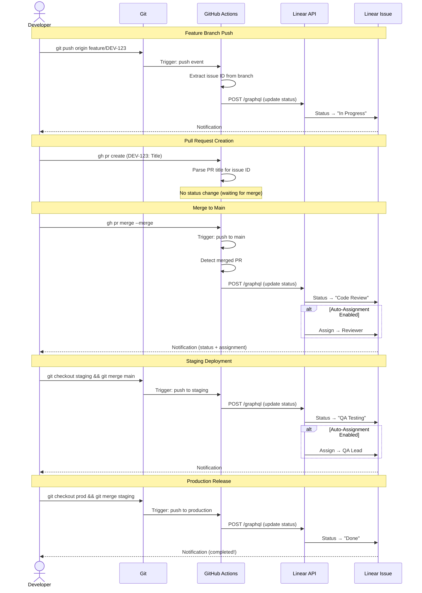
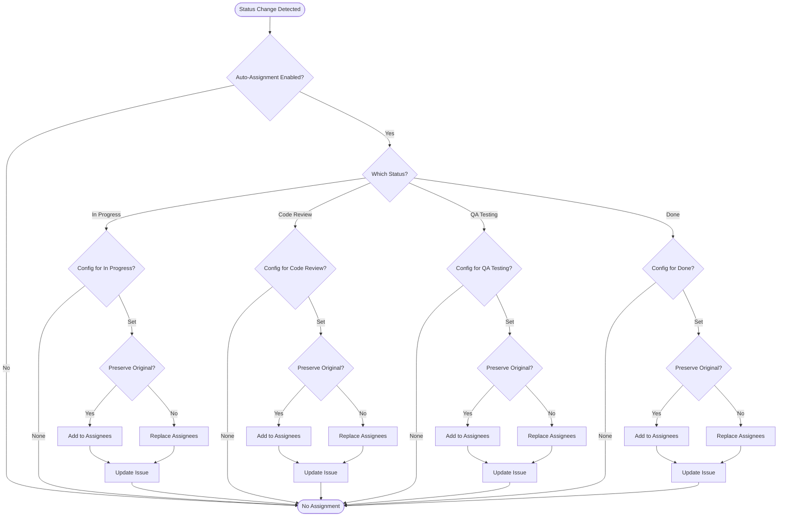
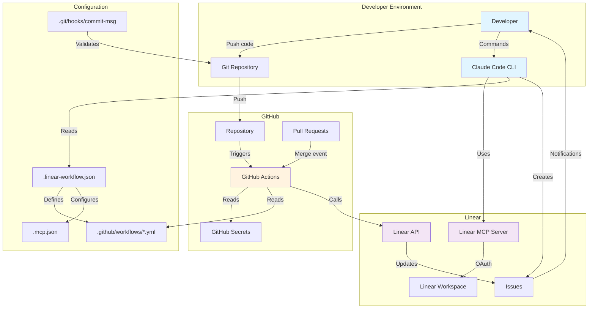
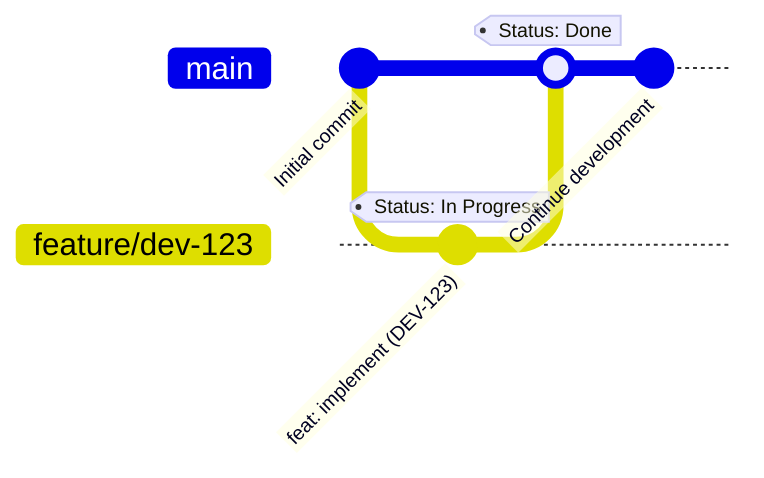
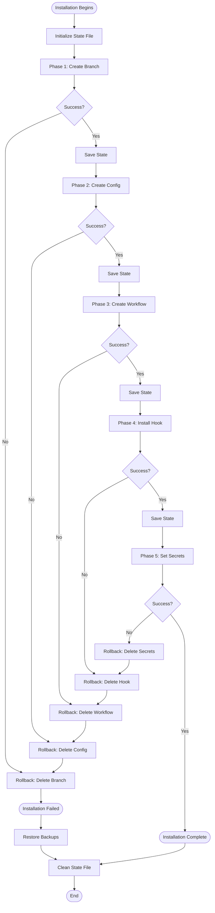
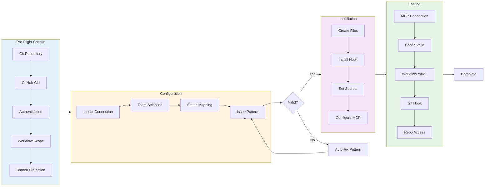

# Workflow Diagrams

Visual representations of the Linear + GitHub + Claude workflow automation.

---

## Table of Contents

- [Setup Wizard Flow](#setup-wizard-flow)
- [Status Update Flow](#status-update-flow)
- [Auto-Assignment Logic](#auto-assignment-logic)
- [Architecture Overview](#architecture-overview)
- [Branch Strategies](#branch-strategies)
- [Error Handling Flow](#error-handling-flow)

---

## Setup Wizard Flow

Complete installation process from start to finish:

```mermaid
flowchart TD
    Start([User: /setup-linear]) --> ConfirmLocation{Confirm Project Location}
    ConfirmLocation -->|Different| AskPath[Ask for Path]
    AskPath --> ValidatePath{Path Exists?}
    ValidatePath -->|No| AskPath
    ValidatePath -->|Yes| CreateBranch
    ConfirmLocation -->|Current| CreateBranch[Create Installation Branch]

    CreateBranch --> PreFlight[Run Pre-Flight Checks]
    PreFlight --> CheckGit{Git Repo?}
    CheckGit -->|No| ErrorGit[Error: Init Git]
    CheckGit -->|Yes| CheckGH{GitHub CLI?}
    CheckGH -->|No| ErrorGH[Error: Install GH CLI]
    CheckGH -->|Yes| CheckAuth{GH Auth + workflow scope?}
    CheckAuth -->|No| FixAuth[Auto-fix: gh auth refresh]
    FixAuth --> CheckAuth
    CheckAuth -->|Yes| CheckBranch{Branch Protection?}
    CheckBranch -->|Blocks| WarnBranch[Warn + Offer Fix]
    CheckBranch -->|OK| Config
    WarnBranch --> Config

    Config[Configuration Wizard] --> Q0{Choose Profile}
    Q0 -->|Startup| Q3
    Q0 -->|Small Team| Q3
    Q0 -->|Enterprise| Q3
    Q0 -->|Custom| Q1

    Q1[Q1: Branch Strategy] --> Q2[Q2: Linear Connection]
    Q2 --> Validate{Validate API Key}
    Validate -->|Fail| Q2
    Validate -->|Pass| Q3[Q3: Status Mapping]
    Q3 --> Q4[Q4: Formats]
    Q4 --> PatternTest{Validate Pattern}
    PatternTest -->|Fail| AutoDetect[Offer Auto-Detect]
    AutoDetect --> Q4
    PatternTest -->|Pass| Q5[Q5: Detail Level]
    Q5 --> Q6[Q6: Doc Location]
    Q6 --> Q7[Q7: Auto-Assignment]

    Q7 --> Summary{Review Summary}
    Summary -->|No| Config
    Summary -->|Yes| DryRun{Run Dry-Run?}

    DryRun -->|Yes| ShowPreview[Show File Preview]
    ShowPreview --> ConfirmInstall{Proceed?}
    ConfirmInstall -->|No| Config
    DryRun -->|No| Install
    ConfirmInstall -->|Yes| Install

    Install[Execute Installation] --> Phase6[Create Files]
    Phase6 --> Phase7[Configure MCP]
    Phase7 --> MCPAuth{User Authenticates /mcp}
    MCPAuth -->|Fail| MCPAuth
    MCPAuth -->|Success| Phase8[Create Templates]
    Phase8 --> Phase9[Create Test Issue]
    Phase9 --> Phase10[Run Auto Tests]

    Phase10 --> Test1{MCP Connection?}
    Test1 -->|Fail| RollbackT[Rollback Installation]
    Test1 -->|Pass| Test2{Config Valid?}
    Test2 -->|Fail| RollbackT
    Test2 -->|Pass| Test3{Workflow YAML?}
    Test3 -->|Fail| RollbackT
    Test3 -->|Pass| Test4{Git Hook?}
    Test4 -->|Fail| RollbackT
    Test4 -->|Pass| Test5{Repo Access?}
    Test5 -->|Fail| RollbackT
    Test5 -->|Pass| FullTest{Run Full Test?}

    FullTest -->|Yes| WorkflowTest[Execute Test Workflow]
    WorkflowTest --> CommitAll
    FullTest -->|No| CommitAll[Commit & Push]

    CommitAll --> Complete([Installation Complete])
    Complete --> UserMerge[User Merges setup/linear-workflow]
    UserMerge --> Activated([Workflow Activated])

    RollbackT --> RestoreState[Restore Previous State]
    RestoreState --> ErrorEnd([Installation Failed])

    ErrorGit --> ErrorEnd
    ErrorGH --> ErrorEnd
```



---

## Status Update Flow

How issues automatically update through the development cycle:



---

## Auto-Assignment Logic

Decision flow for automatic issue assignment:



---

## Architecture Overview

System components and their interactions:



---

## Branch Strategies

Visual comparison of workflow profiles:

### Startup Profile



### Small Team Profile

```mermaid
gitGraph
    commit id: "Initial commit"
    branch feature/dev-456
    checkout feature/dev-456
    commit id: "feat: implement (DEV-456)" tag: "Status: In Progress"
    checkout main
    merge feature/dev-456 tag: "Status: Code Review"
    branch staging
    checkout staging
    merge main tag: "Status: Done"
```

### Enterprise Profile

```mermaid
gitGraph
    commit id: "Initial commit"
    branch feature/eng-789
    checkout feature/eng-789
    commit id: "feat: implement (ENG-789)" tag: "Status: In Progress"
    checkout main
    merge feature/eng-789 tag: "Status: Code Review"
    branch staging
    checkout staging
    merge main tag: "Status: QA Testing"
    branch production
    checkout production
    merge staging tag: "Status: Done"
```

---

## Error Handling Flow

Rollback and recovery process:



---

## Validation Pipeline

Comprehensive validation during setup:



---

## Usage Notes

### Viewing Diagrams

These Mermaid diagrams render automatically in:
- GitHub README/documentation
- GitLab markdown files
- VS Code with Mermaid extension
- JetBrains IDEs with Mermaid plugin

### Editing Diagrams

Use the [Mermaid Live Editor](https://mermaid.live/) to:
- Preview changes in real-time
- Export as PNG/SVG if needed
- Validate syntax

### Diagram Types Used

- **Flowchart**: Setup wizard, decision trees
- **Sequence**: Status update interactions
- **Git Graph**: Branch strategies
- **Graph**: Architecture overview

---

## Integration with Documentation

These diagrams complement the text documentation:

| Diagram | Related Doc |
|---------|-------------|
| Setup Wizard Flow | [Quick Start Guide](docs/quick-start.md) |
| Status Update Flow | [Linear Workflow](docs/linear-workflow.md) |
| Auto-Assignment Logic | [Auto-Assignment](docs/auto-assignment.md) |
| Architecture Overview | [Technical Overview](docs/prerequisites.md) |
| Branch Strategies | [Configuration Profiles](setup/config-profiles.json) |
| Error Handling | [Troubleshooting](docs/troubleshooting.md) |

---

**Questions?** See the [documentation](docs/) or [open an issue](https://github.com/YOUR_USERNAME/claude-linear-gh-starter/issues).
